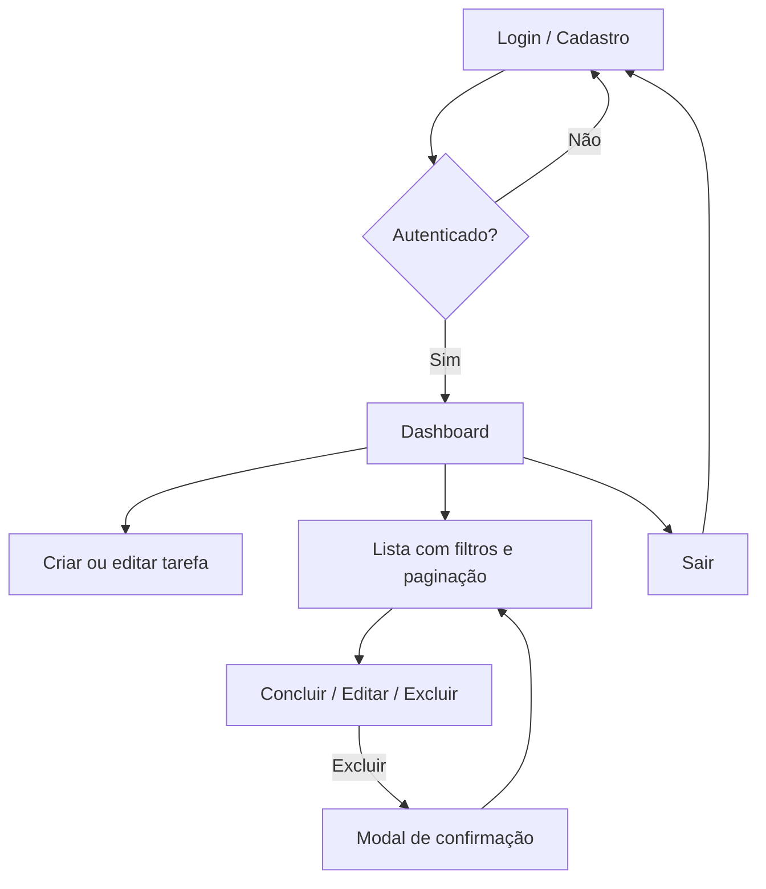

# Entrega acadêmica — Gerenciador de tarefas

## Validação do negócio

O sistema atende a necessidade de **organizar compromissos pessoais ou acadêmicos** com rastreabilidade (status, prioridade, prazo e categoria), **acesso individual** por conta (JWT) e **feedback claro** na interface (sucesso, erro, carregamento, estados vazios). A proposta é viável tecnicamente com stack leve (SQLite + Node + React) e escalável para evoluções futuras (hospedagem, banco gerenciado, notificações).

## Problema

Estudantes e profissionais em formação costumam acumular tarefas em notas dispersas, sem **priorização** nem **prazos visíveis**, o que aumenta esquecimentos e atrasos. Falta um lugar único, **seguro** (cada um vê só o que é seu) e **rápido** de usar no dia a dia.

## Segmento de clientes

- Estudantes (ensino médio e superior) que precisam conciliar disciplinas, trabalhos e prazos.
- Profissionais em início de carreira que gerenciam demandas simples sem ferramentas corporativas pagas.
- Equipes reduzidas ou uso individual para controle de backlog pessoal.

## Persona

**Nome:** Marina, 22 anos.  
**Contexto:** cursa Ciência da Computação, estágio remoto, várias entregas por semana.  
**Objetivo:** registrar tarefas com prioridade e data limite, filtrar o que está pendente e marcar conclusões sem fricção.  
**Frustrações:** interfaces confusas, excesso de cliques e falta de confirmação ao excluir algo importante.

## Jornada do usuário

1. Acessa o sistema e **cria conta** ou **faz login**.
2. No **dashboard**, cria uma tarefa com título, descrição opcional, status, prioridade, categoria e data limite.
3. Consulta o **resumo** (total, pendentes, concluídas) e **filtra** por status, prioridade ou busca por título.
4. **Ordena** a lista (ex.: por prazo ou prioridade), **edita** ou **marca como concluída** com um clique.
5. Ao excluir, confirma no **modal** para evitar erro.
6. Encerra a sessão com **Sair**.

## Fluxo de navegação

## Justificativas de UX

- **Alertas de sucesso e erro** (login, cadastro, formulário e ações na lista) reduzem incerteza após cada operação.
- **Overlay de carregamento** nas telas de autenticação evita cliques duplos e comunica processamento.
- **Resumo numérico** (total / pendentes / concluídas) dá contexto imediato sem abrir relatórios.
- **Filtros alinhados ao modelo mental** (status, prioridade, título) diminuem ruído na lista.
- **Layout em duas colunas no desktop** (formulário fixo à esquerda, lista à direita) aproxima “criar” de “acompanhar”; em **mobile** tudo empilha de forma linear.
- **Estados vazios distintos** (“nenhuma tarefa ainda” vs. “nenhum resultado com esses filtros”) orientam a próxima ação correta.
- **Confirmação antes de excluir** protege contra exclusão acidental, alinhado à persona cautelosa.
- **Tabela responsiva** (colunas secundárias ocultas em telas menores) mantém legibilidade sem scroll horizontal excessivo.

## Funcionalidades implementadas

### Autenticação e sessão

- Cadastro (`POST /register`) e login (`POST /login`) com JWT.
- Rotas protegidas no frontend; token enviado via Axios; tratamento de **401** com redirecionamento ao login.
- Feedback visual em **login** e **cadastro** (erros com `Alert`, overlay de carregamento).
- Mensagem de boas-vindas após **cadastro** ou **login** no dashboard.

### Tarefas (CRUD)

- Criar, listar (paginação), editar, excluir e obter por id.
- Campos: **título**, **descrição**, **status**, **prioridade** (baixa / média / alta), **categoria** (texto curto), **data limite** (AAAA-MM-DD).
- Filtros na API e na UI: **status**, **prioridade**, **busca por título** (`q`).
- Ordenação por vários campos, incluindo prioridade, data limite e categoria.
- **Marcar como concluída** com ação rápida na tabela.
- **Modal de confirmação** para exclusão.
- **Contadores** globais na listagem: total, pendentes (não concluídas), concluídas.

### Qualidade e documentação

- Validação no backend com **express-validator**; mensagens em português.
- **README** na raiz com visão geral, tecnologias, como rodar, rotas e estrutura de pastas.
- Este arquivo (**ENTREGA-ACADEMICA.md**) com contexto de produto e UX.
